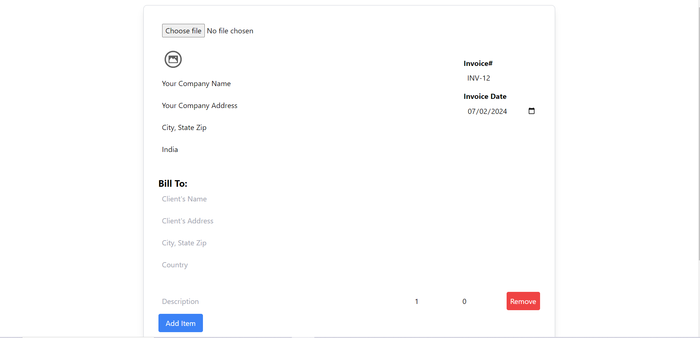

# Invoice Generator

This is a React-based invoice generator application that allows users to input invoice details and generate a PDF invoice. The application provides a real-time preview of the invoice as users input data.

## Features

- Upload a company logo.
- Input company and client information.
- Add, update, and remove invoice items.
- Calculate the total amount.
- Real-time preview of the invoice.
- Download the invoice as a PDF.

## Technologies Used

- React
- @react-pdf/renderer
- react-image-file-resizer

## Installation

1. Clone the repository:

```bash
git clone https://github.com/HARISHKUMAR023/invoice-genarator
cd invoice-generator
```
2. Dependence install:
   
```bash
npm install
```
3. Run the app:
```bash
npm run dev
```
## Thanks for contibution
  Email: harishkumarsp023@gmail.com